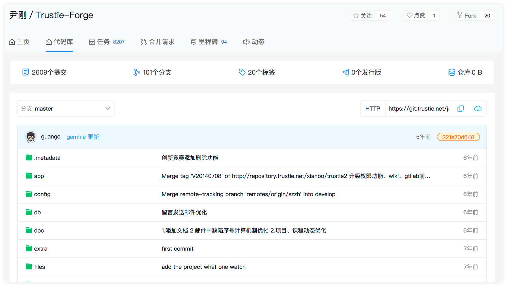
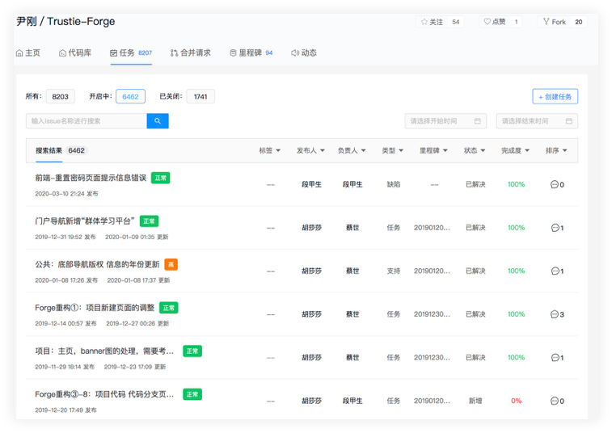
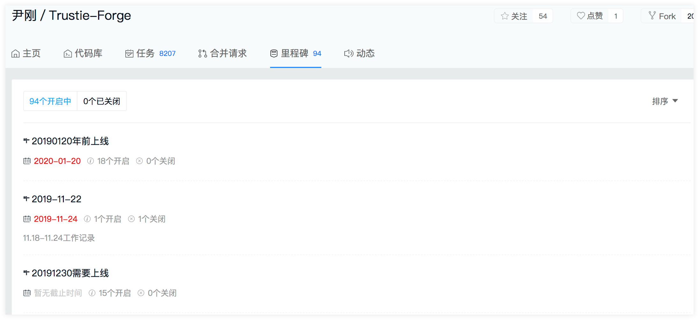

Trustie （确实）是一个以大众化协同开发、开放式资源共享、持续性可信评估为核心机理，面向高校创新实践的在线协作平台 

## 特性

- 软件创作与生产深度融合的软件开发环境体系结构 软件自由创作和工程生产的高效衔接，适于软件开发中群体智慧的有效汇聚。

- 构件化协同开发环境的可扩展运行框架多样化工具的集成和联动，形成了强动态扩展能力的平台框架。

- “互联网即资源库”的全新软件复用模式 成长式软件资源管理系统，实现了分散资源的知识融合、资源的可持续增长和有效复用。

## 部署


#### 1. 安装依赖包

```bash
bundle install
```

#### 2. 配置初始化文件
进入项目根目录执行一下命令：

```bash
cp config/configuration.yml.example config/configuration.yml
cp config/database.yml.example config/database.yml
touch config/redis.yml
touch config/elasticsearch.yml
```

#### 3. 创建数据库

```bash
rails db:create
```

#### 4. 导入数据表结构

```bash
bundle exec rake sync_table_structure:import_csv
```

#### 5. 执行migrate迁移文件
```bash
rails db:migrate RAILS_ENV=development
```

#### 6. 启动rails服务
```bash
rails s
```

#### 7. 浏览器访问
在浏览器中输入如下地址访问：
```bash
http://localhost:3000/projects
```


## 页面展示

- 代码库 




- 任务管理


- 任务查看


- 任务指派 


- 里程碑




